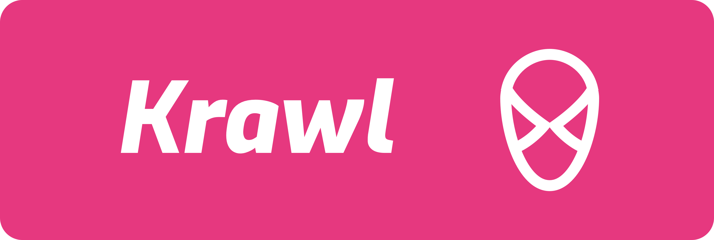

<picture>
  <source media="(prefers-color-scheme: dark)" srcset="./assets/banner-dark.png">
  
</picture>

<h2 align="center">Krawl</h2>

  
  

**👉 English** | [🇨🇳 简体中文](./README.zh-CN.md)

## ✨ Features

## 👋 Getting Started

## 🤝 Contribution

Please read the **[contributing guide](./docs/Contributing%20Guide.md)** and let's build **`krawl`** together.

## ♻️ License

[MIT License](./LICENSE)
